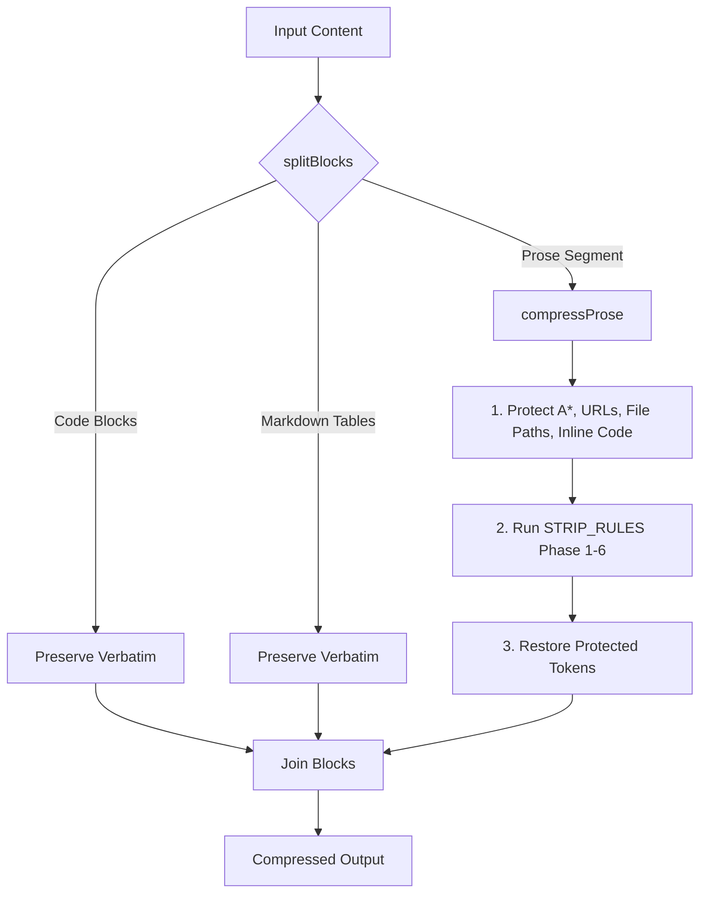

# TITAN — Advanced Technical & Codebase Analysis

## 1. Executive Summary & Value Proposition

### 1.1 Context and Technical Problem
In the current Large Language Model (LLM) agent landscape, context window management and token cost overhead represent major friction points. As agents execute long-running loop-based workflows (e.g., planning, coding, running tests, refactoring), their prompt contexts grow quadratically with the history of the conversation, terminal logs, and system conventions. 

This causes two severe penalties:
1. **Financial Inflation**: LLM pricing is billed per input and output token. Verbose agent reasoning, raw terminal logs, and bloated code blocks multiply operational costs.
2. **Reasoning Degradation (Lost in the Middle)**: Massive contexts degrade LLM attention mechanism accuracy. Superfluous pleasantries, redundant boilerplates, and unfiltered stack traces dilute the operational signal, causing reasoning drift and hallucination.

**TITAN (Token Intelligence Through Agent Narrowing)** addresses this by enforcing token-reduction logic across three independent, orthogonal layers:
* **L1 (Linguistic)**: Prunes natural language syntax down to raw semantic content (Caveman-style telegraphese).
* **L2 (Structural)**: Controls the complexity of generated code using a strict YAGNI ladder (Ponytail-style lazy evaluation).
* **L3 (Contextual)**: Filters static text (markdown memories, terminal build streams) post-hoc.

### 1.2 Quantitative Efficiency Analysis
TITAN operates as a multiplicative savings system. By layering linguistic compression, structural code gates, and contextual stream filtering, it achieves a compounded token reduction of **70% to 85%** on complex agent loops.

$$\text{Total Savings} = 1 - ( (1 - S_{L1}) \times (1 - S_{L2}) \times (1 - S_{L3}) )$$

Where:
* $S_{L1}$ (Linguistic reduction on prose output): **~60%** savings by stripping articles, filler, hedging, and pleasantries.
* $S_{L2}$ (Structural code reduction): **~30% to ~50%** savings by bypassing abstractions, boilerplate, and utilizing native standard libraries.
* $S_{L3}$ (Contextual filter on logs/memories): **~45% to ~60%** savings on static file compression and stack trace pruning.

Mathematically, with conservative inputs ($S_{L1} = 0.60$, $S_{L2} = 0.30$, $S_{L3} = 0.45$):

$$\text{Total Savings} = 1 - (0.40 \times 0.70 \times 0.55) = 1 - 0.154 = 84.6\%$$

The benchmark suites confirm this density improvement. Under mock and empirical runs, **Usable Intelligence Density (UID)**—defined as $\frac{\text{Avg Accuracy \%}}{\text{Avg Total Tokens}} \times 1000$—shows that TITAN variants (e.g., `titan_lite` and `titan_aggressive`) outperform uncompressed baselines by a factor of 1.5x to 3x, preserving accuracy while cutting overhead.

---

## 2. Deep Source Code & Architecture Review

### 2.1 YAML Frontmatter Parser (`src/templates.js`)
The parser in `src/templates.js` implements a zero-dependency, line-by-line state machine designed to parse YAML frontmatter metadata from markdown documents. This logic is critical for adapters converting the master prompt into agent-specific rulesets (e.g., Cursor `.mdc` or Kiro `.kiro/skills`).

#### Design Highlights
1. **RegEx Delimiter Extraction**: It isolates the frontmatter block using `const match = content.match(/^---\r?\n([\s\S]*?)\r?\n---\r?\n([\s\S]*)$/);`. This ensures it only captures the header block starting at line 1, leaving horizontal rules (`---`) in the body intact.
2. **Block Scalar Preservation**: The parser handles literal (`|`) and folded (`>`) block scalars by tracking `inBlockScalar = true` and `blockScalarIndent`. As it parses lines, it strips the minimum indentation of the block and joins them with either newlines (`|`) or spaces (`>`).
3. **Array and Inline Parsing**: Simple array blocks are parsed by matching the leading dashes (`- item`), and inline JSON-like arrays (`[...]`) are parsed using standard string operations, preventing crashes on configuration variables.
4. **Key Validation Gate**: Keys are validated against a static set `SUPPORTED_KEYS`. Non-standard keys emit a non-blocking warning (`console.warn`), protecting adapters from failing if agents introduce custom properties.

#### Computational Bottlenecks
* The block scalar parsing splits the frontmatter by `\r?\n` and iterates sequentially. For exceptionally large frontmatter metadata headers, this linear string parsing incurs slight overhead, though negligible given typical frontmatter sizes under 2KB.

---

### 2.2 Linguistic Compression Engine (`src/compress.js`)
The `src/compress.js` file handles L1 (Linguistic) compression. It partitions the text into structural components (code blocks, tables, prose) and runs a sequential regular expression pipeline over prose segments.



#### RegEx Pipeline Design
1. **Phase 1: Sentence-level removals**: Strips full pleasantry sentences (e.g., `"Sure! I'd be happy to help"`). This represents the highest value pruning.
2. **Phase 2: Multi-word verbose phrases**: Simplifies verbose idioms (e.g., `in order to` $\to$ `to`, `due to the fact that` $\to$ `because`).
3. **Phase 3: Word-level replacements**: Shortens synonyms (e.g., `utilize` $\to$ `use`, `functionality` $\to$ `feature`).
4. **Phase 4: Filler and hedging**: Removes noise words (e.g., `basically`, `actually`, `likely`, `probably`).
5. **Phase 5: Articles**: Strips `the`, `a`, `an` only when followed by a word character (`\b(the|a|an)\s+(?=[A-Za-z])`).
6. **Phase 6: Space Cleanup**: Collapses multiple spaces and trailing whitespace.

#### Sacred Token Protection (State-Protected Lookup)
To prevent rules (like article stripping) from breaking technical keywords, `compressProse` protects tokens using a temporary substitution table before running regex:
* It matches inline code (`` `...` ``), URLs (`https://...`), file paths (`./path/to/file.ext`), and technical algorithms like `A*` (`\bA\*(?!\w)`).
* It replaces them with temporary boundary markers `\x00PROT${idx}\x00`.
* The compression rules run safely over the remaining text.
* The original terms are restored by mapping the markers back to the array index.

#### Markdown Table Preservation
A custom matcher `splitProseAndTables` isolates Markdown tables:
```javascript
const tableRegex = /^(\s*\|[^\n]*\n\s*\|[\s\-:|]*\n(\s*\|[^\n]*\n?)*)/gm;
```
This regex captures lines starting with `|` followed by standard table separators. Tables are isolated into a distinct block type `'table'`, skipping `compressProse` entirely. This ensures that column alignments (which rely on multiple spaces) and cell values are never collapsed or modified.

---

### 2.3 Terminal Stream I/O Filter (`src/filter.js`)
The `src/filter.js` module runs as an I/O stream processor (`titan filter`). It strips noise from stdout/stderr when piping build processes:
`npm run build 2>&1 | titan filter`

#### Implementation Analysis
* **`streamMode()`**: Subscribes to the `line` event of Node's `readline` module over `process.stdin`. It operates in batch/streaming fashion.
* **Vite/npm Noise Suppression**: It rejects lines that match start-up notices, successful build stats, husky headers, and standard dev server banners.
* **Stack Trace Pruning**: When a stack trace is detected (matching lines like `at Function.execute ...`), it uses a state-tracking logic to keep the first line (the error type and description) and the first application-level frame (matching paths in the codebase), discarding all subsequent node-internal frames (e.g., `node:internal/modules/...`).
* **Savings Tracking**: Stash metrics (characters/lines saved) are computed and written to `~/.titan/stats.json` dynamically.

#### Computational Bottlenecks
* The script relies on matching lines sequentially. If a process dumps gigabytes of logs in seconds, the single-threaded CPU bottleneck of Node's regex engine can cause stream blockage (backpressure), which we address in Section 5.2.

---

### 2.4 Agent Adapters & Portability (`src/init.js` & `skills/adapters/`)
TITAN uses the **Adapter Pattern** to distribute prompt rules to various agent runtimes, maintaining universal compatibility across 9+ development environments:

```
                  ┌───────────────────────┐
                  │   skills/master.md    │
                  └───────────┬───────────┘
                              │ (Load)
                              ▼
                       [ initAgent() ]
                              │
            ┌─────────────────┼─────────────────┐
            ▼                 ▼                 ▼
     [ cursor.js ]     [ copilot.js ]     [ windsurf.js ]
            │                 │                 │
            ▼                 ▼                 ▼
   .cursor/rules/...   .github/...md      .windsurf/...
```

Each adapter exports a signature:
* `AGENT_ID`: Unique string identifying the target agent.
* `OUTPUT_PATH`: Location where the agent expects rules.
* `DESCRIPTION`: Human-readable capabilities description.
* `transform(masterContent)`: Custom mapping function.

#### Adapter Transformations
* **`cursor.js`**: Strips the default frontmatter from `master.md` and prepends a custom Cursor-compatible frontmatter specifying `globs: []` and `alwaysApply: true`.
* **`copilot.js`**: Copilot rules cannot use H1 headers (`# Header`), as they disrupt internal prompt indexing. The adapter calls `shiftHeadings(content, 1)` to shift all headings down (H1 $\to$ H2, H2 $\to$ H3), ensuring optimal parsing by GitHub Copilot.
* **`windsurf.js`**: Wraps the rules block in specific metadata headers (`Always On: true`) to comply with Windsurf's rule configuration parser.
* **`cloudcode.js`**: Strips the frontmatter entirely to deliver a pure, plain markdown system prompt to Google Cloud Code / Gemini Code Assist.

---

## 3. Test Suite Validation

### 3.1 Test Philosophy & Setup
TITAN uses the native Node.js test runner (`node:test`) and assertion module (`node:assert`). This maintains the L2 structural compression goal of **zero external dependencies**—bypassing heavy testing libraries like Jest or Mocha. 

Tests are run programmatically via the `titan test` command or `npm test`, executing:
`node --test tests/*.test.js`

### 3.2 Key Testing Targets and Edge Cases
The test coverage guarantees regression protection on critical modules:

1. **`tests/templates.test.js`**:
   * Asserts parsing of Cursor MDC frontmatter configurations.
   * Asserts block scalar literal (`|`) and folded (`>`) multiline parsing.
   * Asserts that invalid frontmatter keys trigger the `console.warn` interceptor but do not cause execution halts.
2. **`tests/debt.test.js`**:
   * Evaluates comment parsing of `// ponytail:` structures across multiple language environments (JavaScript, Python, YAML, Markdown).
   * Validates correct extraction of the ceiling limits and upgrade paths.
3. **`tests/compress.test.js`**:
   * Asserts that `A* search` matches the protected token pattern and is never stripped to `"search"`.
   * Asserts that Markdown tables retain their cell structures, pipes (`|`), and padding spaces, preserving markdown formatting.
4. **`tests/benchmark.test.js`**:
   * Intercepts and captures stdout buffer streams to confirm that the benchmark tool's mock mode prints in correct English and computes statistical averages (means and standard deviations) accurately.

---

## 4. Current Implementation Status & Critical Debt Audit

### 4.1 Debt Tracker (`titan debt`)
TITAN includes a static analysis tool (`titan debt`) that scans codebase files (filtering by extensions like `.js`, `.py`, `.yaml`, `.md`) to find simplifications flagged during coding:
`// ponytail: <ceiling>, <upgrade path>`

#### Code Analysis
The regex `/(?:\/\/|#|\/\*|--|<!--)\s*ponytail:\s*(.+?)(?:\s*\*\/|\s*-->)?$/` extracts:
* **Ceiling**: The immediate simplification threshold (e.g. `mock auth`).
* **Upgrade Path**: The long-term architectural resolution (e.g. `use OAuth2 for prod`).

This tool acts as a lightweight codebase audits checker, providing visibility into the compromises made to reduce token size during rapid iterations.

---

### 4.2 Codebase Implementation Gap Analysis
The actual codebase implements a portion of the core architecture outlined in the theoretical documentation. Below is the mapping of the system's actual features:

| System Layer | Feature / Component | Status in Code | Technical Implementation Reality |
|---|---|---|---|
| **L1 (Linguistic)** | Text Compression | ✅ Implemented | Done via post-hoc regex substitution rules in `src/compress.js`. |
| **L2 (Structural)** | Lazy Ladder Rules | ✅ Implemented | Declared as active prompt rules in `skills/master.md` to shape LLM generation. |
| **L3 (Contextual)** | File Compressor | ✅ Implemented | File compression utility via `titan compress <file>` in `src/cli.js`. |
| **L3 (Contextual)** | Log I/O Filter | ✅ Implemented | CLI streaming log pruner inside `src/filter.js`. |
| **Adapters** | IDE Rules Engine | ✅ Implemented | 9 adapters statically transforming master prompts in `skills/adapters/`. |
| **L2 (Structural)** | Master Auto-injection | ❌ Missing | No automatic runtime IDE hook; rules are generated statically via `titan init`. |
| **Safety** | Auto-Clarity Runtime | ❌ Missing | Only defined as prompting rules; no runtime interception of destructive CLI commands. |
| **L3 (Contextual)** | Context Window Manager | ❌ Missing | No runtime pruning of conversation history or dynamic memory buffer management. |

#### Architectural Implications of Missing Runtime Components
Because the L2 Master Prompt auto-injection, Auto-Clarity runtime safety checks, and Context Window Manager are missing at runtime:
1. **No Runtime Interception**: If an agent runs a destructive command (like `rm -rf`), there is no process-level interceptor. The safety fallback relies solely on the LLM's adherence to the system prompt in `master.md`.
2. **Context Window Drift**: The system cannot prune conversation history dynamically during execution. If the dialogue context overflows, it is up to the developer or the IDE's built-in trim policies to handle it, making TITAN's context compression static.

---

## 5. Production Optimization & Technical Recommendations

To transition the TITAN codebase to an enterprise-ready version 1.0.0, we recommend implementing the following 4 engineering modifications:

### 5.1 RegEx Optimizations to Avoid Catastrophic Backtracking
In `src/compress.js`, several regular expressions use greedy qualifiers and word boundaries that can trigger catastrophic backtracking when processing large files.
* **Problem**: Rules like `/I'?d be happy to help[^.!]*[.!]?\s*/gi` use negated character classes (`[^.!]*)` followed by optional qualifiers. Under long paragraphs without punctuation, the engine backtracks exponentially.
* **Solution**: Replace greedy matches with non-greedy qualifiers, and enforce lookaheads. Pre-compile all regex patterns using a cache map instead of instantiating new regex objects inside iteration loops:
```javascript
// Optimized non-greedy pattern with length limit assertions
const HAPPY_TO_HELP_PATTERN = /I'?d be happy to help[^.!\n]{0,100}[.!]?\s*/gi;
```

---

### 5.2 Stream Flow Control & Backpressure in `src/filter.js`
In `src/filter.js`, the stream processing loops over `process.stdin` using `readline`.
* **Problem**: If `stdin` feeds data faster than the regex matching processes it, memory usage rises, causing thread starvation.
* **Solution**: Implement manual stream pausing when the internal write buffers fill. Track write allocations and hook into `process.stdout.on('drain')`:
```javascript
const readline = require('readline');
const rl = readline.createInterface({ input: process.stdin, output: process.stdout, terminal: false });

rl.on('line', (line) => {
  const processed = filterLine(line);
  if (processed) {
    const ok = process.stdout.write(processed + '\n');
    if (!ok) {
      process.stdin.pause(); // Pause read stream on buffer congestion
    }
  }
});

process.stdout.on('drain', () => {
  process.stdin.resume(); // Resume read stream when buffer drains
});
```

---

### 5.3 Hot-Reloading Adaptable Configuration Engine
The current adapters in `skills/adapters/` are static modules. If an agent changes its rule path (e.g. Cursor changes `.cursor/rules/` to another folder), the source code must be edited and recompiled.
* **Problem**: Inflexible pathing and rules structure.
* **Solution**: Re-architect adapters to load configurations dynamically from a `.titanrules.json` file in the workspace root. This allows developers to overwrite target directories, globs, and metadata headers without changing the core codebase:
```json
{
  "adapters": {
    "cursor": {
      "outputPath": ".cursor/rules/custom-titan.mdc",
      "alwaysApply": true,
      "customGlobs": ["src/**/*.js", "tests/**/*.js"]
    }
  }
}
```

---

### 5.4 Integration with WASM-based Tokenizers
TITAN's `estimateTokens` function uses a rough estimation:
`return Math.ceil(text.length / 4);`
* **Problem**: While fast and dependency-free, this is highly inaccurate for code blocks, JSON structures, and non-English text, leading to inaccurate savings metrics in `stats.json` and the benchmark results.
* **Solution**: Integrate a lightweight, optional WebAssembly-compiled BPE (Byte Pair Encoding) tokenizer (like `cl100k_base` or `gpt-4o` tokenizers). The CLI can download it dynamically or load it locally if available, falling back to character division if WebAssembly is disabled:
```javascript
let tokenizer = null;
try {
  const tiktoken = require('@dqbd/tiktoken/lite');
  const cl100k = require('@dqbd/tiktoken/encoders/cl100k_base.json');
  tokenizer = new tiktoken.Tiktoken(cl100k.bpe_ranks, cl100k.special_tokens, cl100k.pat_str);
} catch (e) {
  // WebAssembly not loaded; fall back to char division
}

function estimateTokens(text) {
  if (tokenizer) {
    return tokenizer.encode(text).length;
  }
  return Math.ceil(text.length / 4);
}
```
This guarantees enterprise-grade token estimation accuracy while maintaining the default zero-dependency configuration.
